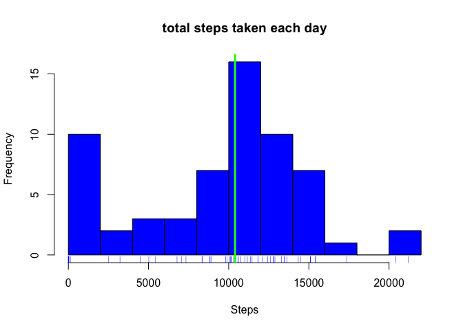
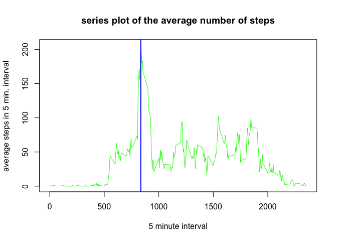
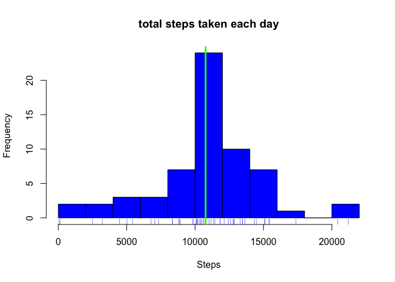
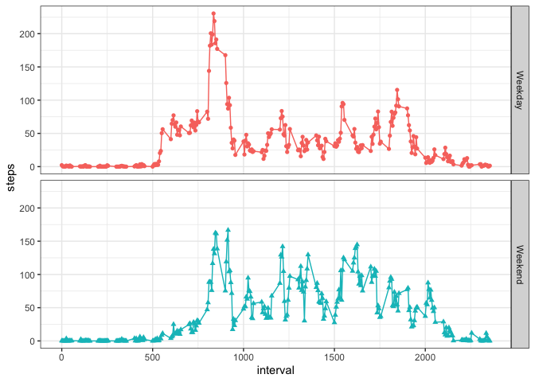

## Introduction
This assignment makes use of data from a personal activity monitoring device. This device collects data at 5 minute intervals through out the day. The data consists of two months of data from an anonymous individual collected during the months of October and November, 2012 and include the number of steps taken in 5 minute intervals each day.  The goal of this assigment is to use the data to answer the following questions:

  - Loading and preprocessing the data
  - What is the mean total number of steps taken per day?
  - What is the average daily activity pattern?
  - Imputing missing values
  - Are there differences in activity patterns between weekdays and weekends?

The answer to these questn are provided in the follwing secctions.

## Loading and preprocessing the data

The dataset is stored in a comma-separated-value (CSV) file and there are a total of 17,568 observations in this dataset.  The file is  included the github submitted with this project. Also, the class project has the data set in the follwing link.

Dataset: Activity monitoring["https://d396qusza40orc.cloudfront.net/repdata%2Fdata%2Factivity.zip"] 

The variables included in this dataset are:
  
  - steps: Number of steps taking in a 5-minute interval (missing values are coded as NA
  - date: The date on which the measurement was taken in YYYY-MM-DD format
  - interval: Identifier for the 5-minute interval in which measurement was taken  

to read the data make sure that the "activity.csv" is in the working directory and use the follwoing code chnk to load the data.

```r
act<-read.csv("activity.csv")
act$date<- as.Date(act$date)
```

## What is the mean total number of steps taken per day?

The following code chunk helps answer this question.  it involves three steps

  - group by date, 
  - sumerize to find total number of steps,  
  - calculate mean median of total number of steps per day and plot histogram
  

```r
## group by date and use function sumerize_at with function sum to find the total number of steps each day then calculae mean median and plot a histogram 
mytot<- act %>% group_by(date) %>% 
    summarise_at(vars(steps),sum,na.rm=TRUE)
mymean<-mean(mytot$steps)
mymedian<-median(mytot$steps)

hist(mytot$steps,12,col="blue",
     main="total steps taken each day",
     xlab="Steps")
rug(mytot$steps,col="blue")
abline(v=mymedian,col="green",lwd=3)
```

<!-- -->

```r
paste("the mean total number of steps taken per day is: ",format(mymean,digits=1),
       "and the median is: ",mymedian,sep=" ")
```

```
## [1] "the mean total number of steps taken per day is:  9354 and the median is:  10395"
```

## What is the average daily activity pattern?

To answer this question:

  - construct a time series plot of the average number of steps taken in an interval.
  - find the 5-minute interval that, on average, contains the maximum number of steps.

*The following code chucnk accomplishes this and construct the plot
  - group be inerval,
  - find the mean for each inteval from all days.  na.rm option is used because the data has missing point
  - the data can be ploted 
  - the interval containing maximum number of steps is found an labeled on the plot

```r
## group act by interval and the find mean for each interval across different dates
## construct a plot
## find and label the 5-minute interval that, on average, contains the maximum umber of steps
itsp <- act %>% group_by(interval) %>% 
    summarise_at(vars(steps),mean,na.rm=TRUE)
    plot(itsp$interval,itsp$steps,type="l",col="green",
         main="series plot of the average number of steps",
         xlab="5 minute interval",
         ylab="average steps in 5 min. interval")
    maxint<-itsp[which.max(itsp$steps),1]
    abline(v=maxint,lwd=2,col="blue")
```

<!-- -->

```r
   paste("The 5-minute interval with maximum number of steps is interval: ",maxint,
         "and the maximum number of steps  in that intervals is: ", 
         format(max(itsp$steps),digits=0 ),"steps",
         sep=" ")
```

```
## [1] "The 5-minute interval with maximum number of steps is interval:  835 and the maximum number of steps  in that intervals is:  206 steps"
```
  
## Imputing missing values

This involves the following: 

  - Calculate and report the total number of missing values in the dataset (i.e. the total number of rows with NAs)
  - fil in all of the missing values in the datas. the mean for that 5-minute interval is used to fill in hte missing data.
  - A new dataset that is equal to the original dataset but with the missing data filled in.
  - A histogram of the total number of steps taken each day was constructed and the mean and median total number of steps taken per day are calculated. 
  
  Do these values differ from the estimates from the first part of the assignment? What is the impact of imputing missing data on the estimates of the total daily number of steps?

The follwoing code chunck implement the strategy for imputing missing data
  - identify the intervals with missing data 
  - detemine the average for these inteval from all the other days where the interval values were not missing using (na.rm)
  

```r
## copy the original accivity data act to mact
## loop through the rows of itsp (the datafrme fram ## CodeChunk_3)
## look for NA missing data for and use the value from itsp to fill it.  itsp is the 
## datarame containing average steps in each interval for all days 
   mact<-act
   for(i in 1:nrow(itsp)){
       myint=as.numeric(itsp[i,1])
       if(sum(is.na(mact[mact$interval==myint & is.na(mact$steps),1]))>0){ 
        mact[mact$interval==myint & is.na(mact$steps),1] <- itsp$steps[i]
       }
   }
```
 
 the code chunck below calculates the mean and median after imputing the data.
 

```r
##Calculate and report the total number of missing values 
nmisng<-sum(is.na(act$steps))
mnmsng<-mean(is.na(act$steps))

paste("total number of missing values in the dataset is: ",nmisng,
"which is about",format(100*mnmsng,digits=0),"%",sep=" ")
```

```
## [1] "total number of missing values in the dataset is:  2304 which is about 13 %"
```

Histogram of the total number of steps taken each day after imputing missing values 


```r
mytot<- mact %>% group_by(date) %>% 
    summarise_at(vars(steps),sum,na.rm=TRUE)

mymean2<-mean(mytot$steps)
mymedian2<-median(mytot$steps)

hist(mytot$steps,12,col="blue",
     main="total steps taken each day",
     xlab="Steps")
rug(mytot$steps,col="blue")
abline(v=mymedian2,col="green",lwd=3)
```

<!-- -->

```r
paste("after imputing missing data, the mean total number of steps taken per day is: ",format(mymean2,digits=1),
       "and the median is: ",format(mymedian2,digits=1),sep=" ")
```

```
## [1] "after imputing missing data, the mean total number of steps taken per day is:  10766 and the median is:  10766"
```

```r
paste("befor imputing missing data, the mean total number of steps taken per day was: ",format(mymean,digits=1),
       "and the median is: ",mymedian,sep=" ")
```

```
## [1] "befor imputing missing data, the mean total number of steps taken per day was:  9354 and the median is:  10395"
```

it is seen that both the mean and median change after imputing missing data.  It is also interesting to note that both mean and median are equal after imputing missing data.  This may be an artifact of the missing data estimation scheme, which used average interval across other days.  

## Are there differences in activity patterns between weekdays and weekends?

The follwoing Panel plot compares the average number of steps taken per 5-minute interval across weekdays and weekends.  To do this, a variable is.weekend was calculated in the code chunk below.  Then, group_by (is.weekend,interval) and summerize_at(steps) to find the total number of steps per day.  ggplot was used to construct the panel plot and the facet_grid(is.weekend ~.) was used to split the data into two panels.


```r
mact$day<-weekdays(mact$date) 

mact$is.weekend [mact$day %in% c("Saturday","Sunday")] <- "Weekend"
mact$is.weekend [!mact$day %in% c("Saturday","Sunday")] <- "Weekday"


mitsp <- mact %>% group_by(is.weekend,interval) %>% 
    summarise_at(vars(steps),mean,na.rm=FALSE)
p<-ggplot(data=mitsp,mapping=aes(x=interval,y=steps,col=is.weekend,pch=is.weekend))
p+geom_line()+
  geom_point()+
  facet_grid(is.weekend~.) +
  theme_bw()+
  theme(legend.position="none")
```

<!-- -->

Based on these plots it appears that the weekdays have higher activity levels than the weekdend.


## Summary
All the R code needed to reporuced the reuslts including numbers and plots are provided in this report.  The report calculated the mean and median of the original data.  A way to imput missiing data was implemented and new mean and median were caluculated. The results show that imputing missing data has some impact on the number of total daily steps, the mean and the median.  The imputed data  was processed to investigate the difference in activity levels between weeends and weedky. It was shown that the activity level was higher on the weekday.

